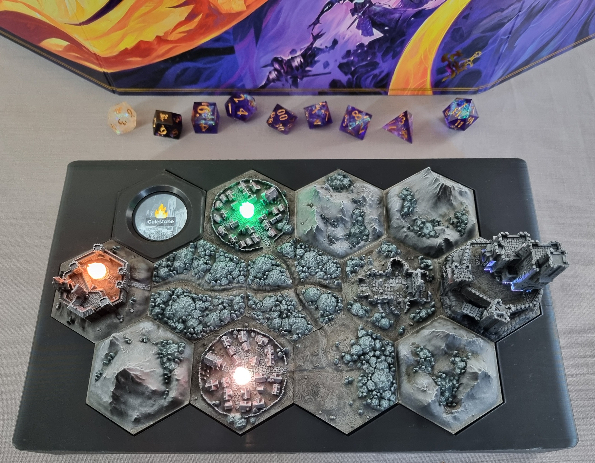

# ttrpg-hex-map-console

## Overview and background

This repo contains the software, schematics, and 3D-printable models for the physical interactive hex map "console" I built for my [Daggerheart: Age of Umbra](https://www.daggerheart.com/umbra/) campaign.

In the Age of Umbra campaign setting, communities gather around Sacred Pyres: beacons of hope in an otherwise bleak and desolate world. During a recent campaign I ran as DM, part of the storyline involved these Pyres becoming corrupted, extinguished, and relit anew. I wanted to build a physical prop that could represent the state of the world, including these pyres, as a player aid. And so this project was born.

The console includes a 3D hex map of the small corner of the Halcyon Domain in which my campaign ran. Four LEDs, connected to an ESP32-S3 touchscreen dev board, represent the Pyres and other atmospheric lighting within the map. The touchscreen device itself is integrated into a hex tile in the top left corner of the console. To reflect what happens in-game as it happens, Pyres may be extinguished or corrupted using the touchscreen or wirelessly using an HTTP API that the ESP32-S3 software serves.

## Features

- 🔥 LED "Pyres" with flicker and transition effects.
- 📱 [Waveshare ESP32-S3-Touch-LCD-1.28](https://www.waveshare.com/wiki/ESP32-S3-Touch-LCD-1.28) device embedded in the hex map provides touchscreen controls for each Pyre.
- 🌐 An HTTP API enables wireless control of each Pyre, as well as battery/power information.
- 🔋 Power is provided by an internal Li-Ion battery that can be charged via a USB-C port.
- 🏔️ 3D-printed and hand-painted hex map tiles (models by [Hexton Hills](https://www.hextonhills.com/)).
- 📦 3D-printed enclosure:
  - Separate body and lid, assembled together using screws.
  - USB-C port.
  - Slide switch to power on/off.

## Repo structure

This repo contains the following materials, please see individual READMEs for more details:

- docs/ -- miscellaneous documentation and photos.
- electronics/ -- schematics for the ESP32-S3, GPIO, LEDs, and associated electronic circuitry.
- firmware/ -- the software that runs on the ESP32-S3, including patches for the base MicroPython firmware, and the touchscreen app.
- hardware/ -- models and details of the 3D-printed hardware.

## License and contributing

This project is MIT licensed. Feel free to use and adapt whatever parts of it for your own TTRPG campaign.
