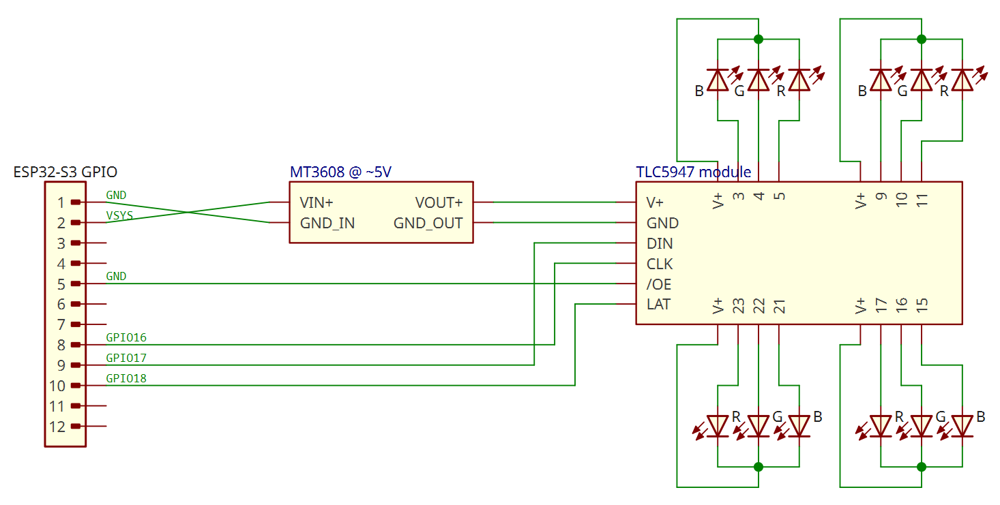
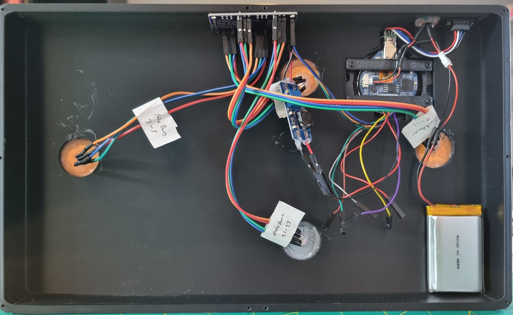

# Electronics

This directory contains the schematics for the circuitry powering project.

## Bill of materials

1. [Waveshare ESP32-S3-Touch-LCD-1.28](https://www.waveshare.com/wiki/ESP32-S3-Touch-LCD-1.28): touchscreen and microcontroller that drives the console LEDs.
2. 4x common anode RGB LEDs: for the Pyres and other lighting.
3. TLC5947 24-channel 12-bit PWM LED driver module (CJMCU clone of the [Adafruit module](https://www.adafruit.com/product/1429)): allows the ESP32-S3 to drive multiple LEDs from only a few GPIO outputs.
4. MT3608 boost converter module: steps up the VSYS rail provided by the ESP32-S3 to 5V required by the TLC5947.
5. 3.7V 2000mAh 103454 LiPo Rechargeable Battery: powers the board for ~6-7 hours.
6. (Optional if battery doesn't already have one) 3.7V 3A Li-ion BMS PCM battery protection board: disconnects the cell if it charges too high or discharges too low.
7. MX 1.25 connector for battery to ESP32-S3.
8. Slide switch: to power console on/off.
9. USB-C 4-pin female chassis: USB port.
10. USB-C 4-pin male breakout board: connects ESP32-S3 USB-C to female chassis.
11. Wiring to connect everything up.

## Schematics

### Power to ESP32-S3

The LiPo battery connects to the ESP32-S3 board via the MX 1.25 connector. The slide switch is wired inline with the battery positive lead. The USB-C chassis port is extended from the board's onboard port via a male-to-female breakout.

**NOTE**: for the battery to charge, the slide switch must be in the ON position.

### GPIO to LEDs

## Interior assembly

See photo for internal component layout within the enclosure. Liberal usage of hot glue ensures most components do not rattle about. Please forgive the "prototype quality"!!

