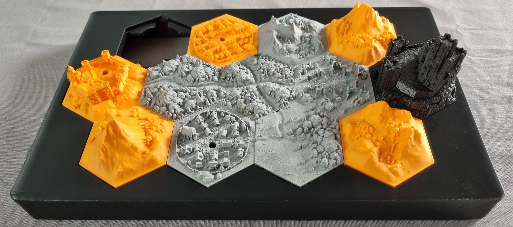
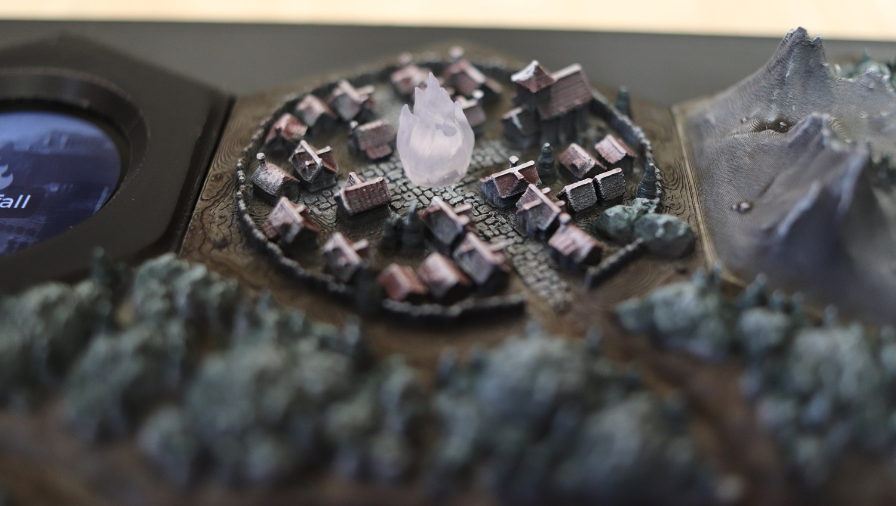

# Hardware

This directory contains the custom-designed and specialised 3D assets for the project.

## File guide

- enclosure/
  - body.stl -- the main body of the console. Includes mounting points for the assembled hex map grid, holes for LEDs and the ESP32-S3 in the top, and holes for a female USB-C adapter and slide switch in the side.
  - lid.stl -- the back lid of the console. Secured to the body using 10x 16mm M2 self tapping round head screws.
- hex-map/
  - display-hex.stl -- the hex body within which the [Waveshare ESP32-S3-Touch-LCD-1.28](https://www.waveshare.com/wiki/ESP32-S3-Touch-LCD-1.28) device sits, and a restraining bar that screws into place using 2x 10mm M2 self tapping round head screws.
  - flame.stl -- the flame-shaped cap that sits over LEDs. Printed in clear/transparent plastic for obvious reasons.
  - hexton-hills - Age of Umbra.json -- BOM of Hexton Hills tiles for the hex map. View using the [Hexton Hills Map Planner](https://map.hextonhills.com/).
  - hexton-hills - Age of Umbra.png -- export of the hex tile map from the Hexton Hills Map Planner.

## 3D printing notes

**Hex tiles**

- Printer: Bambu Lab A1 (FDM).
- Settings: 0.08mm "high quality".
- Filament: Bambu PLA Matte Grey/Orange, Elegoo Rapid PLA+ Black.
- Notes: Since I painted the tiles, the underlying colour did not matter so much EXCEPT for the hollowed-out castle, where the orange colour would bleed through. I reprinted this in black for the final piece.

**Enclosure**

- Printer: Bambu Lab A1 (FDM).
- Settings: 0.20mm "standard".
- Filament: Elegoo Rapid PLA+ Black.
- Notes: The body was printed in one piece on its side, arranged diagonally across the build plate. Despite lowering nozzle speeds and other settings to prevent vibrations from affecting the print as it grew taller, there was some "wavy" artifacting on the top edge. Ideally one would use a printer with a sufficiently large build plate to print this flat. I judged that the lid would be far too precarious to print on its side, so I had to print it flat in two pieces.

**Flame caps**

- Printer: Elegoo Mars 3 Pro (SLA).
- Settings: 0.05mm layer height, 7s layer exposure.
- Resin: Anycubic High Clear.
- Notes: I purposefully did not follow the advice to "clear up" the prints post-processing, leaving them frosty instead of fully transparent. This nicely diffuses the bright LED light.

## Painting notes

My goal was to capture the desaturated and bleak tone of the Age of Umbra setting by depicting the world illuminated by moonlight. My rough recipe was:

**Basecoat**

- Strong zenithal prime (white over black) from north only, to simulate moonlight from that direction.

**Ground**

- Mummified Grime (Army Painter Speedpaint 2.0).

**Mountains and stone buildings**

- Nuln Oil wash (Citadel).
- Light drybrush highlight with a mix of Fenrisian Grey (Citadel) + White (Vallejo), in the direction of the light.

**Trees and foliage**

- Gunner Camo (Army Painter Speedpaint 2.0).
- Rough highlight with a mix of Fenrisian Grey + White + Gunner Camo, in the direction of the light.

**Town roofs**

- Goddess Glow (Army Painter Speedpaint 2.0), trying to leave areas in shadow as pure black.
- Initial rough highlight with a mix of Fenrisian Grey + White + Goddess Glow, in the direction of the light.
- Final bright highlight of White + tiny amount of Fenrisian Grey on edges that would catch moonlight.

**Final**

- Airbrush varnish with Vallejo Matt Varnish.
